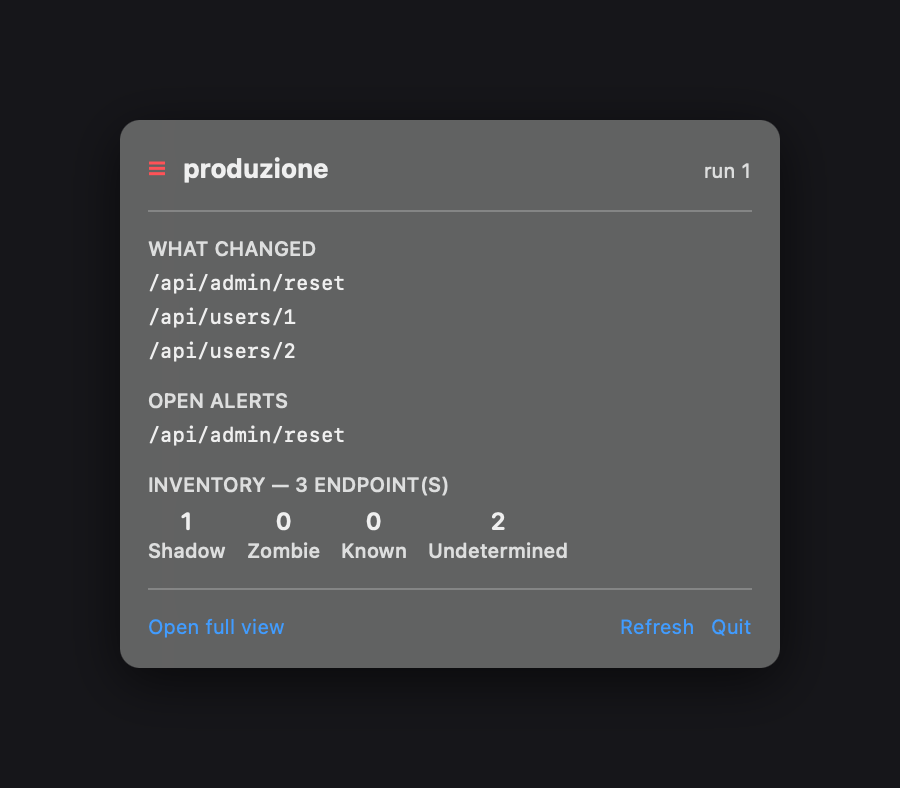
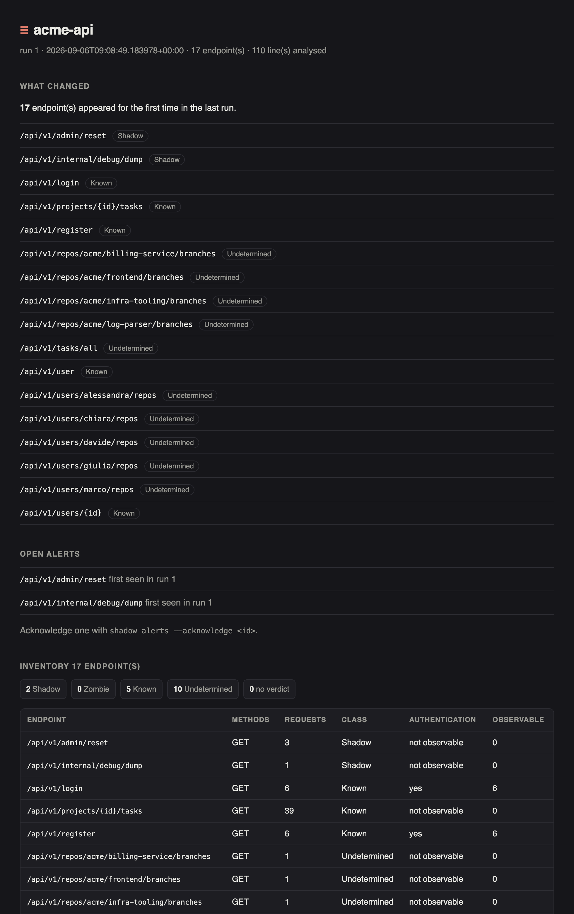

<div align="center">

# ≡ SHADOWS — API

### Shadow API discovery from your web server logs

**Find the API endpoints that answer but nobody documented.**

Point it at an nginx or Apache access log. It tells you which endpoints are
actually responding that are **not** in your OpenAPI spec — *shadow endpoints* —
and which are documented but no longer answer — *zombie endpoints*.

Offline by design. It never opens a network connection, it never phones home,
and your logs never leave the machine.

`shadow API detection` · `undocumented endpoints` · `API inventory` ·
`OpenAPI drift` · `zombie endpoints` · `nginx log analysis` · `PCI DSS 4.0
endpoint inventory` · `Rust` · `CLI`

</div>

<div align="center">

### Download

[**↓ macOS — Shadow.dmg**](https://github.com/theghostshinobi/shadows-api/releases/latest/download/Shadow-macos-arm64.dmg) · [**↓ Linux x86_64**](https://github.com/theghostshinobi/shadows-api/releases/latest/download/shadow-linux-x86_64.tar.gz) · [**↓ Linux ARM64**](https://github.com/theghostshinobi/shadows-api/releases/latest/download/shadow-linux-aarch64.tar.gz)

[all releases and checksums](https://github.com/theghostshinobi/shadows-api/releases)

</div>

---

## Who this is for

- You have an OpenAPI spec and a suspicion that reality has drifted from it.
- You need an **endpoint inventory** for an audit — PCI DSS 4.0 asks for one —
  and you would rather derive it from real traffic than from a wiki page.
- You run an API gateway and want to know what appeared after last Thursday's
  deploy, without installing an agent or sending traffic anywhere.
- Someone asked *"are we sure nothing undocumented is exposed?"* and you want a
  better answer than *"probably"*.

---

## What it is

```
$ shadow /var/log/nginx/access.log --openapi-spec openapi.json

observed endpoints (17)
  8c6b9716…  GET   /api/v1/users/{id}                39  auth: not observable
  a41c0f22…  POST  /api/v1/admin/reset                3  auth: no (based on 3 of 3 observable)
  …

findings (22)
  Shadow        high    severity high   a41c0f22…  /api/v1/admin/reset
      because not present in the declared inventory
      because it answers without observed authentication
  …
```

Exit code `3`, so a CI pipeline can fail on purpose.

## What it is **not**

This list matters as much as the one above, and the tool says it about itself in
every report it produces.

- **Not a security certification.** It is a discovery aid. It tells you what to
  go and look at.
- **Not runtime protection.** It does not block traffic. It is not a WAF.
- **Not a scanner.** It generates no traffic towards your systems. It reads logs
  that already exist.
- **Not a cloud service.** It does not phone home. There is no telemetry.

## Four verdicts, and one of them is "I don't know"

| Verdict | Meaning |
|---|---|
| **Shadow** | Observed in traffic, absent from the declared inventory |
| **Zombie** | Declared, but not observed for longer than the staleness window |
| **Known** | Observed and matches a declared endpoint |
| **Undetermined** | Uncertain or partial match — **a first-class result, never quietly promoted to Known** |

A wrong `Known` is an endpoint nobody will ever look at again. A wrong
`Undetermined` is an endpoint somebody looks at once too often. The tool is
built around that asymmetry.

The same discipline governs **authentication**, which carries **four** values and
never collapses into present/absent:

`yes` · `no` · `mixed` · `not observable`

`not observable` means the log format does not carry the information. It is
**not** evidence that authentication was missing — and next to it you always
get the number of observable requests the verdict rests on, because
*"no auth observed"* and *"no auth observed, on 3 requests out of 5000"* are not
the same statement.

## The four ways to look at it

<div align="center">

</div>

| | Command |
|---|---|
| **Terminal** | `shadow status` |
| **Self-contained page** | `shadow dashboard --out state.html` |
| **Local server** | `shadow serve` |
| **macOS menu bar** | `Shadow.app` |

All four show the **same view**. They cannot disagree, because they read the
same structure.

<div align="center">

</div>

## Getting started

```bash
# analyse a log once
shadow access.log --openapi-spec openapi.json

# your server adds fields to the log format? declare it — it never guesses
shadow access.log --log-format '$remote_addr - $remote_user [$time_local] "$request" $status $body_bytes_sent "$http_referer" "$http_user_agent" $request_time'

# remember what you have seen, and watch over time
shadow daemon access.log --openapi-spec openapi.json --history shadow.db --interval 60

# what appeared and nobody has looked at yet
shadow alerts --history shadow.db

# the endpoint inventory, for whoever runs the review
shadow compliance --history shadow.db --format csv > inventory.csv
```

There is a step-by-step walkthrough in **[docs/TUTORIAL.md](docs/TUTORIAL.md)**.

## How it works on each system

The engine is the same everywhere: **one binary, `shadow`, with no runtime
dependencies.** What differs is only how you look at it.

### Linux — the server case

This is what Shadow was built for: it sits on the machine that already has the
logs, and never moves them.

```bash
tar -xzf shadow-linux-x86_64.tar.gz
sudo install -m 755 shadow /usr/local/bin/

# watch a log continuously, and keep a page up to date next to it
shadow daemon /var/log/nginx/access.log \
       --openapi-spec /etc/shadow/openapi.json \
       --history /var/lib/shadow/history.db --target payments-api \
       --interval 60 --dashboard /var/www/html/shadow.html
```

Two ways to look at it, and neither needs a desktop:

- **terminal** — `shadow status`, `shadow alerts`, `shadow compliance`, over ssh;
- **web page** — the daemon rewrites `shadow.html` after every cycle, and the
  page re-reads itself. Serve it with whatever web server you already run, or
  use `shadow serve` for a local read-only server on `127.0.0.1:8787`.

There is no Linux GUI app, and there is no plan for one: on a server the
terminal and a page are the two things that actually get used.

It runs fine under `systemd`; a unit file is a dozen lines and the daemon needs
no privileges beyond reading the log and writing its history.

### macOS — the desktop case

Everything the Linux side does, plus a menu bar app.

```bash
# from the DMG: drag Shadow.app onto Applications, and copy the binary
sudo cp /Volumes/Shadow/shadow /usr/local/bin/
```

Then tell the app where to look, in
`~/Library/Application Support/Shadow/menubar.json` — it writes an example one
for you the first time you launch it.

> **The macOS build is not signed or notarised.** macOS refuses downloaded
> unsigned apps on first launch. Right-click `Shadow.app` → **Open** → **Open**,
> or `xattr -dr com.apple.quarantine /Applications/Shadow.app`.
>
> This is a real gap, not a formality: signing needs an Apple Developer account,
> which belongs to a person and not to a repository. Until there is one, you are
> being asked to trust a build you cannot verify through Apple — which is
> exactly the kind of request you should be suspicious about, including here.
> Every archive ships with its SHA-256, and you can always build from source.

### Building from source

Rust 1.85 or newer, and nothing else. No network access at build time or at run
time — SQLite is compiled from source that ships inside the dependency.

```bash
cargo build --release          # -> target/release/shadow
cargo test --workspace         # 241 checks
sh macos/build.sh              # -> macos/build/Shadow.app  (macOS only)
```

## The rules it will not break

These are not aspirations. Each one is enforced by tests that fail if it stops
being true.

- **It fails loudly, never quietly wrong.** If the log format does not match, it
  refuses to read the file rather than pull fields from the wrong positions. A
  plausible-but-invented number is worse than an error.
- **Redaction is on by default**, everywhere it prints or persists — report,
  manifest, history, dashboard. Logs carry tokens in URLs and emails in query
  strings, and a report gets pasted into shared tickets.
- **Same input, same verdict.** Including with a daemon running: time, arrival
  order and accumulated state never change what it concludes.
- **It never merges what it cannot prove is the same.** `admin` does not get
  swallowed into `{id}`, no matter how many identifiers surround it.
- **No manifest, no verdict.** An invocation that analyses nothing never claims
  "no findings".
- **One socket, in one file.** Only `shadow serve` listens, only when you ask,
  only on `127.0.0.1` unless you say otherwise, and read-only.

## Status

Pre-1.0, and honest about it. The analysis pipeline and the persistence layer
are complete and tested; the licence text still has placeholders, and the name
is provisional.

## Licence

Business Source License 1.1 — free for individual use, paid for commercial use,
converting to an open licence after four years.

> **The licence text is not finished.** Several parameters are still
> placeholders. Until they are filled in, treat this repository as source-
> available for inspection, not as licensed for use.

## A note on languages

Everything a user reads is in **English**: the command line, the reports, the
evidence, this README. The project's own design documents — the blueprint, the
progress log, the field-test notes — are in **Italian**, and stay that way: they
are a conversation between the people building it.
